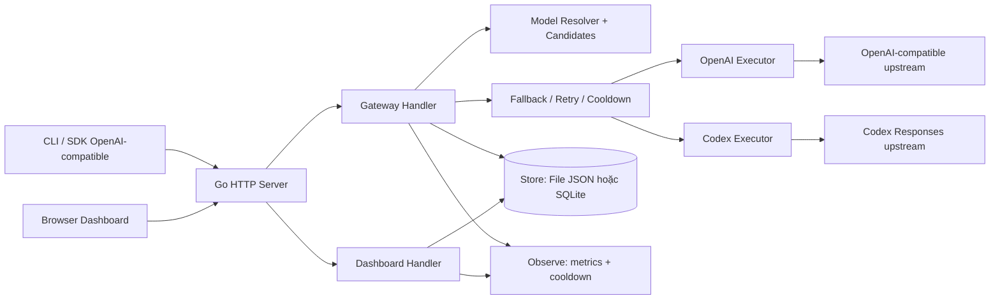
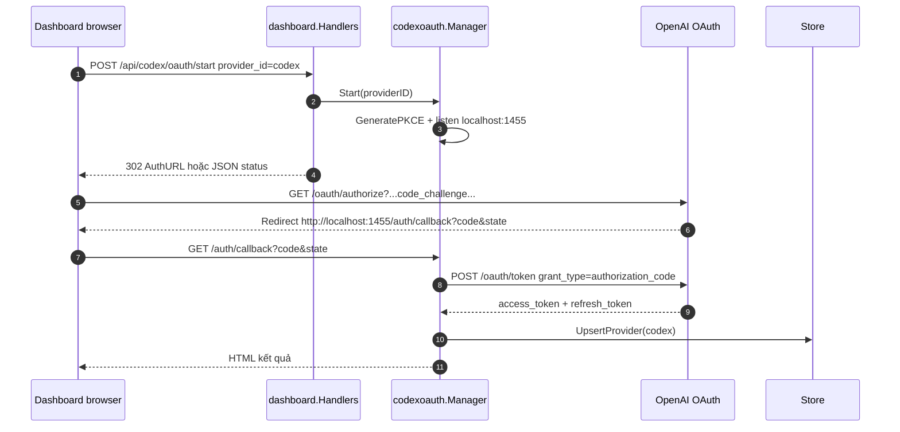
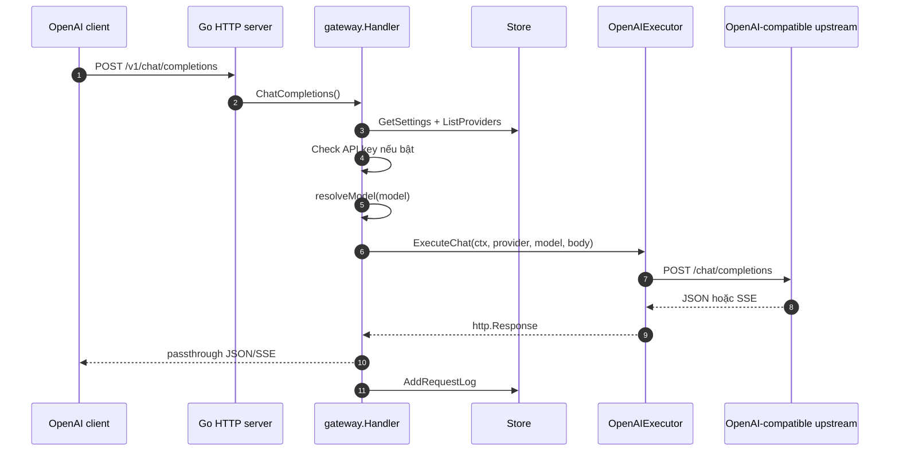
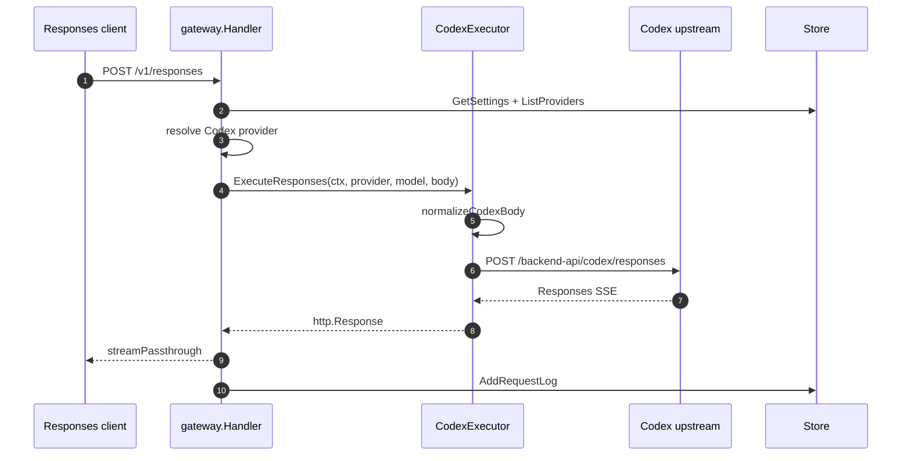
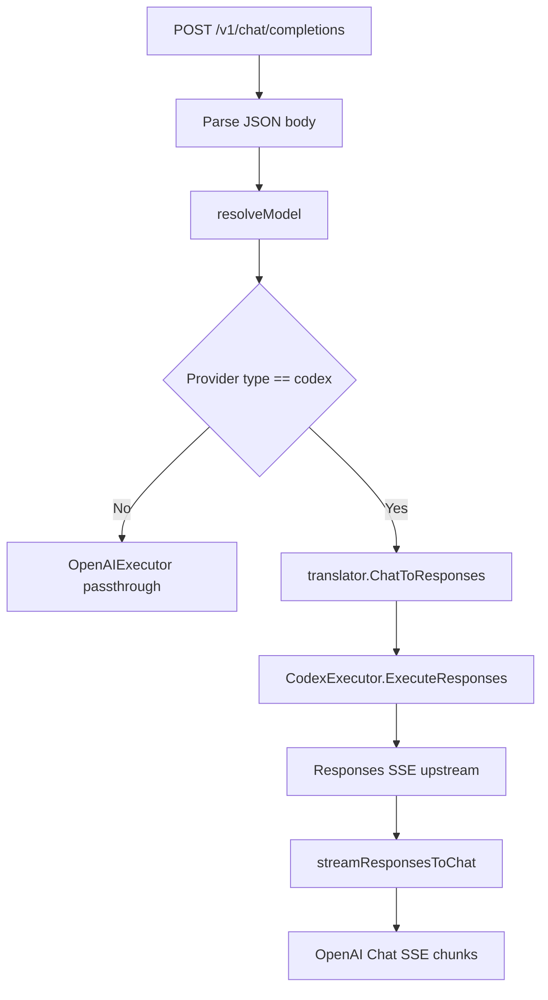
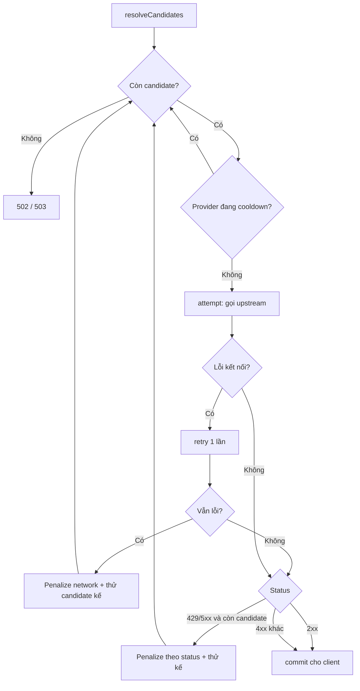

# Kiến trúc VivuRouter Go

Tài liệu này mô tả cấu trúc hiện tại của dự án mẫu [`vivurouter-go`](../), để AI hoặc developer có thể tiếp tục phát triển mà không cần đọc lại toàn bộ code.

## Mục tiêu kiến trúc

Dự án mẫu hướng tới một gateway nhẹ bằng Go:

- Một binary phục vụ cả FE dashboard và BE gateway.
- FE server-rendered bằng HTML template.
- BE dùng Go standard library, ưu tiên `net/http`, `context.Context` và `http.Client` có pooling.
- Không phụ thuộc Node.js.
- Không sửa dự án VivuRouter gốc.
- Phạm vi ban đầu chỉ có OpenAI-compatible và Codex.

## Sơ đồ cấp cao



## Cấu trúc thư mục hiện tại

```text
vivurouter-go/
├── cmd/vivurouter-go/main.go
├── internal/
│   ├── app/
│   │   ├── middleware.go
│   │   ├── routes.go
│   │   └── server.go
│   ├── auth/
│   │   └── apikey.go
│   ├── codexoauth/
│   │   └── codex.go
│   ├── config/
│   │   └── config.go
│   ├── dashboard/
│   │   ├── handlers.go
│   │   └── viewmodels.go
│   ├── gateway/
│   │   ├── errors.go
│   │   ├── fallback.go
│   │   ├── handler.go
│   │   ├── router.go
│   │   ├── sse.go
│   │   ├── usage.go
│   │   └── util.go
│   ├── observe/
│   │   ├── cooldown.go
│   │   ├── metrics.go
│   │   └── state.go
│   ├── provider/
│   │   ├── codex.go
│   │   ├── executor.go
│   │   └── openai.go
│   ├── store/
│   │   ├── file.go
│   │   ├── sqlite.go
│   │   └── store.go
│   └── translator/
│       ├── chat_to_responses.go
│       ├── responses_to_chat.go
│       └── types.go
├── web/
│   ├── static/
│   │   ├── app.css
│   │   └── app.js
│   └── templates/
│       ├── dashboard.html
│       ├── layout.html
│       ├── providers.html
│       ├── requests.html
│       └── settings.html
└── scripts/
    ├── dev.ps1
    └── smoke.ps1
```

## Thành phần chính

### Entrypoint

[`main.go`](../cmd/vivurouter-go/main.go) làm ba việc:

1. Đọc runtime config bằng [`config.Load()`](../internal/config/config.go).
2. Khởi tạo store theo `STORE_BACKEND`: [`store.NewFileStore()`](../internal/store/file.go) hoặc [`store.NewSQLiteStore()`](../internal/store/sqlite.go).
3. Khởi tạo và chạy HTTP server bằng [`app.NewServer()`](../internal/app/server.go) trong goroutine.
4. Chờ SIGINT/SIGTERM rồi `server.Shutdown(ctx)` với `SHUTDOWN_TIMEOUT` (graceful shutdown).

### App layer

[`server.go`](../internal/app/server.go) wire các thành phần:

- [`observe.New()`](../internal/observe/state.go) tạo state metrics + cooldown dùng chung.
- [`provider.NewExecutors()`](../internal/provider/executor.go) tạo executor dùng chung `http.Client`.
- [`gateway.NewHandler()`](../internal/gateway/handler.go) tạo gateway API handler (nhận cả `observe.State`).
- [`codexoauth.NewManager()`](../internal/codexoauth/codex.go) tạo Codex OAuth manager dùng chung store.
- [`dashboard.NewHandlers()`](../internal/dashboard/handlers.go) tạo dashboard handler và nhận OAuth manager để phục vụ nút kết nối Codex.
- Middleware được bọc theo thứ tự recovery → metrics → logging → CORS.
- `http.Server` set `ReadHeaderTimeout` và `IdleTimeout`, **không** set `WriteTimeout` để tránh cắt SSE.

[`routes.go`](../internal/app/routes.go) khai báo toàn bộ route:

| Path | Handler | Vai trò |
|---|---|---|
| `/` | Dashboard home | Redirect dashboard. |
| `/dashboard` | Dashboard page | Tổng quan trạng thái. |
| `/providers` | Dashboard providers | Form quản lý provider. |
| `/requests` | Dashboard requests | Request log gần đây. |
| `/settings` | Dashboard settings | Cấu hình API key/default provider. |
| `/api/health` | Management API | Health check. |
| `/api/config` | Management API | Đọc/ghi settings. |
| `/api/providers` | Management API | CRUD provider tối giản. |
| `/api/codex/oauth/start` | Management API | Bắt đầu Codex OAuth, trả auth URL hoặc redirect. |
| `/api/codex/oauth/status` | Management API | Trạng thái phiên Codex OAuth hiện tại. |
| `/api/requests/recent` | Management API | Request log gần đây. |
| `/api/metrics` | Management API | Metrics runtime + cooldown snapshot. |
| `/api/usage/stats` | Management API | Tổng hợp request/token/cost. |
| `/api/usage/timeseries` | Management API | Usage/cost bucket theo thời gian và budget status. |
| `/api/usage/recent` | Management API | Request log kèm token/cost. |
| `/api/cooldowns` | Management API | Provider đang cooldown. |
| `/debug/pprof/*` | Debug | Profiling khi `DEBUG=true`. |
| `/v1/models` | Gateway | OpenAI-compatible models list. |
| `/v1/messages` | Gateway | Anthropic Messages-compatible bridge for Claude Code/Claude CLI. |
| `/v1/chat/completions` | Gateway | OpenAI Chat Completions. |
| `/v1/responses` | Gateway | Codex/OpenAI Responses. |
| `/codex/responses` | Gateway | Alias Codex. |
| `/codex/v1/responses` | Gateway | Alias Codex. |

### Config layer

[`config.go`](../internal/config/config.go) đọc env:

| Env | Mặc định | Ý nghĩa |
|---|---|---|
| `HOSTNAME` | `127.0.0.1` | Host bind. |
| `PORT` | `20129` | Port bind. |
| `DATA_DIR` | `./data` | Nơi lưu `sample-db.json` (file) hoặc `sample.sqlite` (sqlite). |
| `ASSETS_DIR` | auto-detect `web` | Thư mục template/static. |
| `STORE_BACKEND` | `file` | `file` (JSON) hoặc `sqlite` (pure-Go). |
| `REQUIRE_API_KEY` | `false` | Bật/tắt kiểm tra local API key. |
| `LOCAL_API_KEY` | rỗng | API key local nếu bật. |
| `DEBUG` | `false` | Bật route `pprof`. |
| `SHUTDOWN_TIMEOUT` | `15` | Số giây drain khi graceful shutdown. |

### Store layer

[`store.go`](../internal/store/store.go) định nghĩa contract [`Store`](../internal/store/store.go):

- `GetSettings` / `SaveSettings`
- `ListProviders` / `GetProvider` / `UpsertProvider` / `DeleteProvider`
- `AddRequestLog` / `RecentRequestLogs`

[`file.go`](../internal/store/file.go) implement bằng JSON file:

- File: `DATA_DIR/sample-db.json`.
- Có mutex đọc/ghi.
- Ghi bằng file tạm rồi rename để giảm rủi ro corrupt.

[`sqlite.go`](../internal/store/sqlite.go) implement bằng SQLite pure-Go (`modernc.org/sqlite`, không cgo):

- File: `DATA_DIR/sample.sqlite` (WAL, busy_timeout 5s, `SetMaxOpenConns(1)`).
- Bảng `settings` (JSON blob), `providers`, `request_logs` (có index theo timestamp).
- Retention request log thực thi bằng `DELETE ... NOT IN (... LIMIT keep)`.

Cả hai backend chia sẻ [`SeedProviders()`](../internal/store/store.go) và [`NormalizeModels()`](../internal/store/store.go) nên hành vi giống nhau; bộ test CRUD trong [`store_test.go`](../internal/store/store_test.go) chạy cho cả hai.

### Auth layer

[`apikey.go`](../internal/auth/apikey.go) hỗ trợ:

- Đọc API key từ `Authorization: Bearer ...`.
- Đọc API key từ `x-api-key`.
- So sánh constant-time nếu `settings.RequireAPIKey` bật.

Hiện auth chỉ áp dụng cho gateway `/v1/*`, chưa bảo vệ dashboard.

### Gateway layer

Gateway chính nằm ở [`handler.go`](../internal/gateway/handler.go).

Các handler quan trọng:

- [`Models()`](../internal/gateway/handler.go) trả OpenAI-format model list.
- [`ChatCompletions()`](../internal/gateway/handler.go) xử lý `/v1/chat/completions`; build `attempt`/`commit` rồi giao cho fallback engine. Codex được bridge ngay trong `attempt`.
- [`Responses()`](../internal/gateway/handler.go) xử lý `/v1/responses` và alias Codex, dùng `codexCandidates`.
- [`runWithFallback()`](../internal/gateway/fallback.go) là vòng lặp chung: thử từng candidate, bỏ qua provider đang cooldown, retry tại chỗ 1 lần cho lỗi kết nối, và chỉ commit response 2xx cho client.

[`router.go`](../internal/gateway/router.go) resolve model thành **danh sách candidate**:

- `resolveCandidates()` trả primary (giữ hành vi cũ: provider ID hoặc type, hoặc default provider) cộng các provider cùng type làm fallback.
- `resolveModel()` cũ vẫn còn, trả candidate đầu để giữ tương thích.
- Provider phải `Enabled=true`.

[`fallback.go`](../internal/gateway/fallback.go) quyết định fallback:

- Lỗi fallback-eligible: lỗi kết nối, HTTP 429, HTTP 5xx.
- 429 đọc `Retry-After` (giây hoặc HTTP date) để đặt cooldown; 5xx/network dùng cooldown ngắn mặc định, giới hạn `maxCooldown`.
- 4xx khác (trừ 429) được passthrough cho client, không fallback.
- Hết candidate khả dụng → 502 (lỗi cuối) hoặc 503 (tất cả đang cooldown).

[`sse.go`](../internal/gateway/sse.go) xử lý stream:

- `streamPassthrough`: copy SSE upstream về client và parse usage từ SSE event khi có.
- `streamResponsesToChat`: parse Responses API SSE event rồi emit Chat Completions chunk, đồng thời thu usage từ `response.completed`/`response.done`.
- Dùng `r.Context()` để ngắt khi client disconnect.

[`usage.go`](../internal/gateway/usage.go) phụ trách usage/cost tracking tối thiểu:

- Extract usage từ OpenAI Chat JSON/SSE (`usage.prompt_tokens`, `completion_tokens`, details cache/reasoning).
- Extract usage từ Responses API (`response.usage.input_tokens`, `output_tokens`, details cache/reasoning).
- Extract usage kiểu Gemini/Ollama ở mức tối thiểu để dễ mở rộng provider sau.
- Nếu upstream không trả usage, estimate input token từ body JSON và output token từ độ dài output stream/JSON.
- Tính `cost_usd` bằng pricing mặc định cho một số model OpenAI hoặc env override `USAGE_PRICE_*_PER_1M`.
- Ghi token/cost vào [`RequestLog`](../internal/store/store.go), hiển thị trên dashboard và `/api/usage/*`.
- [`internal/dashboard/usage_series.go`](../internal/dashboard/usage_series.go) bucket request logs thành time-series cho `today`, `24h`, `7d`, `30d` và tính budget status theo ngày/tháng UTC từ `Settings.DailyBudgetUSD`, `Settings.MonthlyBudgetUSD`, `Settings.BudgetAlertPct`.

### Provider layer

[`executor.go`](../internal/provider/executor.go) tạo `Executors` dùng chung một `http.Client` có connection pooling.

[`openai.go`](../internal/provider/openai.go):

- Build URL: `{provider.BaseURL}/chat/completions`.
- Set `Authorization: Bearer <api_key/access_token>`.
- Passthrough body, chỉ thay `model` bằng model đã resolve.
- Nếu `stream=true`, set `Accept: text/event-stream`.

[`codex.go`](../internal/provider/codex.go):

- Upstream mặc định: `https://chatgpt.com/backend-api/codex/responses`.
- Force `stream=true`.
- Force `store=false`.
- Inject default instructions nếu thiếu.
- Set headers `originator`, `User-Agent`, `session_id`, `Authorization`.
- Strip field Codex dễ reject như `temperature`, `top_p`, `max_tokens`, `stream_options`, `metadata`, `previous_response_id`.

### Observe layer

[`internal/observe/`](../internal/observe/) chứa state runtime dùng chung qua [`observe.State`](../internal/observe/state.go):

- [`metrics.go`](../internal/observe/metrics.go): đếm in-flight (gauge atomic), total request, status bucket (2xx/4xx/5xx...), upstream failures, outcome (`fallback`, `all_cooldown`). `Snapshot()` trả bản copy an toàn cho JSON/template.
- [`cooldown.go`](../internal/observe/cooldown.go): map `providerID → until` có mutex; `Penalize` không rút ngắn cooldown dài hơn đang có; `Available` và `Snapshot` tự prune entry hết hạn. **In-memory**, reset khi restart.

Metrics được cập nhật bằng `metricsMiddleware` (in-flight/total/status) và bởi fallback engine (upstream fail/outcome). Dashboard panel Runtime và `/api/metrics` đọc từ đây. Usage/cost là dữ liệu bền hơn trong request log/store, không nằm trong metrics atomic in-memory.

### Translator layer

[`chat_to_responses.go`](../internal/translator/chat_to_responses.go) chuyển Chat Completions sang Responses API tối thiểu:

- System message đầu tiên → `instructions`.
- User/assistant text → Responses `message` item.
- `image_url` → `input_image`.
- Assistant `tool_calls` → `function_call` item.
- Tool result → `function_call_output` item.
- Chat tools → Responses function tools.

[`responses_to_chat.go`](../internal/translator/responses_to_chat.go) hiện chỉ là placeholder cho non-stream parity. Streaming conversion đang nằm trong [`sse.go`](../internal/gateway/sse.go).

[`anthropic.go`](../internal/translator/anthropic.go) bridge Anthropic Messages API cho Claude Code/Claude CLI:

- Anthropic `system`/`messages`/`tools`/`tool_choice` sang OpenAI Chat.
- Giữ context dài, nhiều text blocks, `tool_use`, `tool_result`, unknown blocks dạng JSON text.
- Tự chèn tool response rỗng khi OpenAI cần response sau `tool_calls` nhưng Claude history chưa có.
- OpenAI Chat non-stream JSON sang Anthropic `message` response.

[`anthropic_sse.go`](../internal/gateway/anthropic_sse.go) chuyển OpenAI/Codex SSE sang Anthropic event stream (`message_start`, `content_block_delta`, `message_stop`).

### Dashboard layer

[`handlers.go`](../internal/dashboard/handlers.go) phục vụ:

- HTML pages.
- Form POST cho providers/settings.
- JSON management APIs.

Templates nằm trong [`web/templates/`](../web/templates/). Static assets nằm trong [`web/static/`](../web/static/).

### Codex OAuth layer

[`internal/codexoauth/codex.go`](../internal/codexoauth/codex.go) mô phỏng flow Codex CLI của VivuRouter gốc:

- `client_id`: `app_EMoamEEZ73f0CkXaXp7hrann`.
- Authorize endpoint: `https://auth.openai.com/oauth/authorize`.
- Token endpoint: `https://auth.openai.com/oauth/token`.
- Redirect cố định: `http://localhost:1455/auth/callback`.
- Scope: `openid profile email offline_access`.
- PKCE: S256, dùng `code_verifier` + SHA256 base64url `code_challenge`.
- Extra params: `id_token_add_organizations=true`, `codex_cli_simplified_flow=true`, `originator=codex_cli_rs`.

`Manager.Start()` tạo phiên OAuth, mở callback listener local port 1455 và trả `AuthURL`. Callback `/auth/callback` kiểm tra `state`, exchange `code` bằng form `application/x-www-form-urlencoded`, rồi `UpsertProvider` để lưu token vào provider type `codex`.

## Luồng Codex OAuth onboarding



## Luồng request OpenAI-compatible



## Luồng request Codex Responses



## Luồng Chat Completions sang Codex



## Luồng fallback nhiều provider



## Dữ liệu JSON hiện tại

File store lưu dạng:

```json
{
  "settings": {
    "require_api_key": false,
    "local_api_key": "",
    "default_provider": "openai",
    "default_codex_id": "codex",
    "keep_request_logs": 200,
    "dashboard_message": "..."
  },
  "providers": [
    {
      "id": "openai",
      "type": "openai-compatible",
      "name": "OpenAI Compatible",
      "base_url": "https://api.openai.com/v1",
      "api_key": "...",
      "enabled": true,
      "models": ["gpt-4.1", "gpt-4o-mini"]
    },
    {
      "id": "codex",
      "type": "codex",
      "name": "Codex Responses",
      "base_url": "https://chatgpt.com/backend-api/codex/responses",
      "access_token": "...",
      "refresh_token": "...",
      "enabled": true,
      "models": ["gpt-5-codex"]
    }
  ],
  "request_logs": []
}
```

## Điểm mở rộng quan trọng

### Thêm provider mới

1. Thêm provider type constant ở [`store.go`](../internal/store/store.go).
2. Tạo executor mới trong [`internal/provider/`](../internal/provider/).
3. Thêm field vào [`Executors`](../internal/provider/executor.go).
4. Sửa [`ChatCompletions()`](../internal/gateway/handler.go) hoặc tạo route riêng để dispatch.
5. Cập nhật dashboard provider type trong [`providers.html`](../web/templates/providers.html).

### Thêm endpoint gateway mới

1. Tạo method mới trong [`gateway.Handler`](../internal/gateway/handler.go) hoặc file riêng.
2. Đăng ký route trong [`routes.go`](../internal/app/routes.go).
3. Nếu cần upstream mới, thêm executor.
4. Nếu cần format mới, thêm translator.
5. Cập nhật README và smoke script.

### Chọn backend store (đã có file + sqlite)

1. Interface [`Store`](../internal/store/store.go) giữ nguyên cho mọi backend.
2. [`file.go`](../internal/store/file.go) (JSON) và [`sqlite.go`](../internal/store/sqlite.go) (SQLite pure-Go) đã implement.
3. [`main.go`](../cmd/vivurouter-go/main.go) chọn backend theo `STORE_BACKEND`.
4. Thêm backend mới: implement interface, thêm nhánh trong `openStore()`, thêm vào `store_test.go`.

## Vấn đề kỹ thuật cần lưu ý

- Không được buffer toàn bộ SSE response vào memory.
- Luôn dùng `r.Context()` khi gọi upstream để client disconnect có thể hủy request.
- Khi thêm map/global state phải có TTL hoặc cleanup (cooldown tracker tự prune; nhưng vẫn in-memory, mất khi restart).
- Không log token/API key thô.
- `statusRecorder` trong middleware phải forward `Flush()` để SSE không bị buffer khi đi qua metrics/logging middleware.
- `WriteTimeout` cố tình để trống cho SSE; chống slowloris bằng `ReadHeaderTimeout`.
- `streamResponsesToChat` mới hỗ trợ subset event cơ bản; cần mở rộng nếu Codex trả event mới.
- `responses_to_chat.go` là placeholder, chưa có non-stream conversion.
- Codex OAuth hiện chỉ persist `access_token` và `refresh_token`; `id_token` được decode ở token response nhưng chưa có field riêng trong `Provider`.
